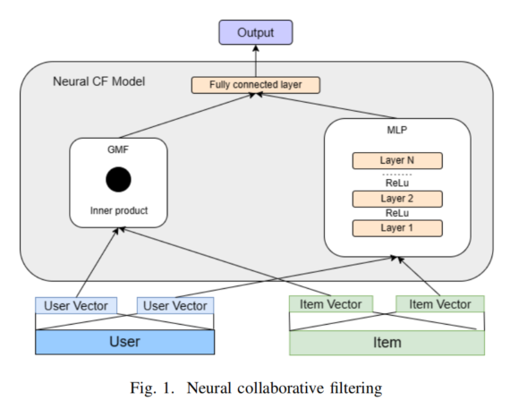
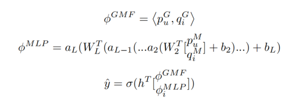
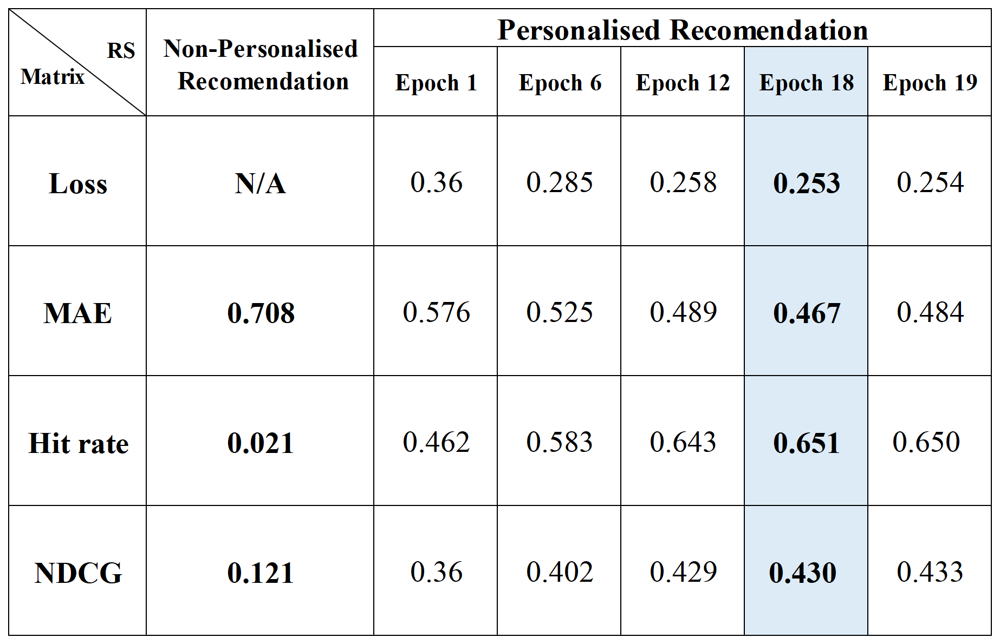
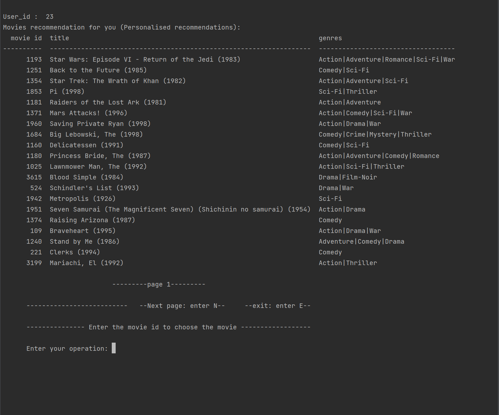

# Neural-Collaborative-Filtering-in-movie-recommendation
This report will focus on the movie recommendation domain, applying deep learning techniques to replace traditional matrix inner product summation in collaborative filtering and improve the learning ability of the model. 
[paper](report.pdf)

## INTRODUCTION
The ability to accurately recommend content that interests
users determines a streaming service’s appeal to a certain
extent. Nowadays, the matrix factorisation technique
has been widely applied to the recommendation system.
Correspondingly, various advanced techniques like deep
learning are proposed and utilized in collaborative filtering.
Following this motivation, this report will focus on the movie
recommendation domain, applying deep learning techniques
to replace traditional matrix inner product summation in
collaborative filtering and improve the learning ability of
the model. Neural Collaborative Filtering combines the
features of both the Generalised Matrix Factorisation and
Multi-Layer Perceptron, and thereby the model can predict
user interests more accurately. Besides, the report will
compare the NCF model recommendation performance with
the non-personalised recommendation algorithm by three
evaluation matrices.

  
## METHODS

  
## Result

  
## User Interface

